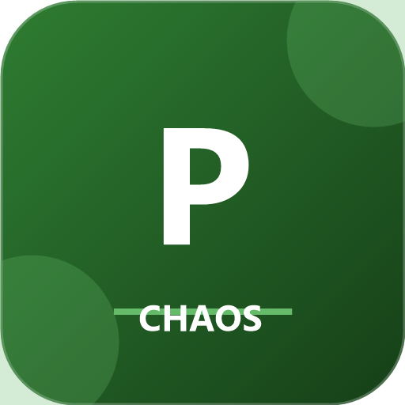

# PollyChaos



[](https://www.nuget.org/packages/PollyChaos)
[](https://www.nuget.org/packages/PollyChaos)
[](https://github.com/Swevo/PollyChaos/actions/workflows/build.yml)

**Chaos engineering for Polly v8.** Inject faults and latency into your resilience pipelines to prove your system handles failures gracefully — before production does it for you.

The **Simmy-compatible** chaos companion for Polly v8. If you used `Polly.Contrib.Simmy` with Polly v7, this is what you have been waiting for.

## Install

```
dotnet add package PollyChaos
```

## Quick start

```csharp
using PollyChaos;

// Throw an exception on 10% of calls
var pipeline = new ResiliencePipelineBuilder()
    .AddChaosFault(injectionRate: 0.1)
    .AddRetry(new RetryStrategyOptions { MaxRetryAttempts = 3 })
    .Build();

await pipeline.ExecuteAsync(ct => httpClient.GetAsync("/api/orders", ct), cancellationToken);
```

## Why PollyChaos?

| Feature | Polly.Contrib.Simmy (v7) | PollyChaos (v8) |
|---|---|---|
| Polly version | v7 only | **v8** |
| Fault injection | ✅ | ✅ |
| Latency injection | ✅ | ✅ |
| `Enabled` toggle | ✅ | ✅ |
| Generic pipeline (`Builder<T>`) | ✅ | ✅ |
| Callbacks (`OnFaultInjected`) | ❌ | ✅ |
| .NET 9 support | ❌ | ✅ |
| Zero extra dependencies | ❌ | ✅ |

## Usage

### Fault injection

```csharp
// Throw ChaosException on 10% of calls
var pipeline = new ResiliencePipelineBuilder()
    .AddChaosFault(injectionRate: 0.1)
    .Build();

// Throw a custom exception
var pipeline = new ResiliencePipelineBuilder()
    .AddChaosFault(injectionRate: 0.05, fault: new HttpRequestException("injected failure"))
    .Build();
```

### Latency injection

```csharp
// Add a 2-second delay on 5% of calls
var pipeline = new ResiliencePipelineBuilder()
    .AddChaosLatency(injectionRate: 0.05, latency: TimeSpan.FromSeconds(2))
    .Build();
```

### Combined chaos pipeline

```csharp
var pipeline = new ResiliencePipelineBuilder<HttpResponseMessage>()
    .AddChaosFault<HttpResponseMessage>(injectionRate: 0.05)   // 5% exceptions
    .AddChaosLatency<HttpResponseMessage>(injectionRate: 0.1)  // 10% slow calls
    .AddRetry(new RetryStrategyOptions<HttpResponseMessage> { MaxRetryAttempts = 3 })
    .AddCircuitBreaker(new CircuitBreakerStrategyOptions<HttpResponseMessage>())
    .Build();
```

### Toggle via configuration (feature flag)

Flip chaos on/off without rebuilding the pipeline — ideal for integration test environments:

```csharp
var chaosOptions = new ChaosFaultStrategyOptions
{
    InjectionRate = 0.2,
    Enabled = config.GetValue<bool>("ChaosEngineering:Enabled"),
    FaultFactory = () => new TimeoutException("chaos: downstream timeout"),
    OnFaultInjected = args =>
    {
        logger.LogWarning("Chaos fault injected for {Operation}", args.Context.OperationKey);
        return ValueTask.CompletedTask;
    },
};

var pipeline = new ResiliencePipelineBuilder()
    .AddChaosFault(chaosOptions)
    .Build();
```

### ASP.NET Core integration

```csharp
// Program.cs
builder.Services.AddResiliencePipeline("orders-client", (pipelineBuilder, context) =>
{
    var config = context.ServiceProvider.GetRequiredService<IConfiguration>();
    var chaosEnabled = config.GetValue<bool>("ChaosEngineering:Enabled");

    pipelineBuilder
        .AddChaosFault(new ChaosFaultStrategyOptions
        {
            InjectionRate = 0.1,
            Enabled = chaosEnabled,
        })
        .AddChaosLatency(new ChaosLatencyStrategyOptions
        {
            InjectionRate = 0.05,
            Latency = TimeSpan.FromSeconds(3),
            Enabled = chaosEnabled,
        })
        .AddRetry(new RetryStrategyOptions { MaxRetryAttempts = 3 })
        .AddCircuitBreaker(new CircuitBreakerStrategyOptions());
});
```

## Pipeline order

Place chaos strategies **outside** (before) retry so injected faults are retried — just like real failures:

```csharp
var pipeline = new ResiliencePipelineBuilder()
    .AddChaosFault(injectionRate: 0.1)   // 1. inject faults
    .AddChaosLatency(injectionRate: 0.1) // 2. inject latency
    .AddRetry(...)                        // 3. retry failures
    .AddCircuitBreaker(...)              // 4. trip if too many failures
    .Build();
```

## Related packages

| Package | Description |
|---|---|
| [PollyBackoff](https://www.nuget.org/packages/PollyBackoff) | Backoff delay strategies |
| [PollyMediatR](https://www.nuget.org/packages/PollyMediatR) | Polly v8 pipelines for MediatR request handlers |
| [PollyEFCore](https://www.nuget.org/packages/PollyEFCore) | Polly v8 resilience for EF Core queries and SaveChanges |
| [PollyHealthChecks](https://www.nuget.org/packages/PollyHealthChecks) | [](https://www.nuget.org/packages/PollyHealthChecks) | ASP.NET Core health checks for Polly v8 circuit breakers |
| [PollyOpenAI](https://www.nuget.org/packages/PollyOpenAI) | [](https://www.nuget.org/packages/PollyOpenAI) | Polly v8 resilience for OpenAI and Azure OpenAI — retry on 429, Retry-After, circuit breaker |
| [PollyRedis](https://www.nuget.org/packages/PollyRedis) | [](https://www.nuget.org/packages/PollyRedis) | Polly v8 resilience for StackExchange.Redis — retry, circuit breaker, timeout |
| [PollySignalR](https://www.nuget.org/packages/PollySignalR) | [](https://www.nuget.org/packages/PollySignalR) | Polly v8 exponential back-off reconnect policy for SignalR HubConnection |
| [PollyCaching](https://www.nuget.org/packages/PollyCaching) | Caching resilience strategy |
| [PollyBulkhead](https://www.nuget.org/packages/PollyBulkhead) | Bulkhead isolation |
| [PollyRateLimiter](https://www.nuget.org/packages/PollyRateLimiter) | Rate limiting strategies |
| [PollyOpenTelemetry](https://www.nuget.org/packages/PollyOpenTelemetry) | OpenTelemetry metrics & tracing |

## Support

If PollyChaos helps you ship more resilient software, consider supporting the project:

[](https://github.com/sponsors/Swevo)

> 💼 **Need .NET resilience help?** Visit [solidqualitysolutions.com](https://solidqualitysolutions.com/) for consulting and architecture services.

## License

MIT
